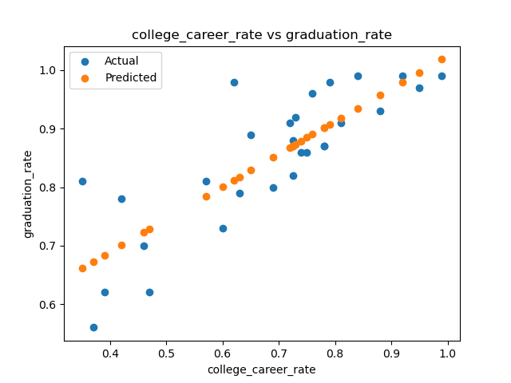

# Program 2: School Success

**Due date: Friday, March 7, 2024 at 12:00pm. No late submissions allowed.**

This assignment's learning objective is to deepen your understanding on data manipulation, feature engineering, simple (1-dimensional) linear regression, loss functions, and model evaluation. This assignment will also check for coding style using the [pylint](https://www.pylint.org/) linter.

Since the assignment's focus is on understanding the concepts, instead of using one of the many great python packages that already exist, you'll be coding the algorithms yourself using pandas –and the python standard library.

In this program you will use [pandas](https://pandas.pydata.org) to read and manipulate NYC school data, and you will build linear models to predict school's graduation rates.
   
**Learning Objectives**

- build competency with pandas for storing and cleaning data
- feature engineering, including categorical (one-hot) encoding
- understand train-test splits in practice
- train 1-dimensional linear models
- validate your models and choose the best one among multiple candidates
   
**Available Libraries**: Python 3\.9\+ and pandas.

### Grading rubric
```
Code linting -- 10 points
Section 1: Data ingestion and feature  -- 40 points
Section 2: Training a linear regressor -- 30 points
Section 3: Model evaluation -- 20 points
```
   
### Dataset
For this program, we will use the overview of high schools maintained by the Department of Education and available each year for rising 9th graders to choose a high school:

- [2021 DOE High School Directory](https://data.cityofnewyork.us/Education/2021-DOE-High-School-Directory/8b6c-7uty)
- [2020 DOE High School Directory](https://data.cityofnewyork.us/Education/2020-DOE-High-School-Directory/23z9-6uk9)
- [2019 DOE High School Directory](https://data.cityofnewyork.us/Education/2019-DOE-High-School-Directory/uq7m-95z8)
   
For your convenience you can also find two smaller sample datasets in the repository:
- `2021_DOE_High_School_Directory_SI.csv`: 2021 dataset restricted to Staten Island schools.
- `2020_DOE_High_School_Directory_late_start.csv`: schools with 9am start times in 2020 dataset.


### Submission notes
* Programs are submitted via Gradescope, and can only use the libraries specified above.
* Using a jupyter notebook is recommended, but submissions of either a jupyter notebook file (`.ipynb`) or a python script (`.py`) are accepted.
* If your file includes code outside of functions, either comment the code out before submitting or use a `main()` function to conditionally execute it (see [Think CS: Section 6.8](https://runestone.academy/ns/books/published//thinkcspy/Functions/mainfunction.html) for details).

*Tip*: As you write your functions, test them locally on the small test files and compare against the expected output provided below. When it all works, upload your file to Gradescope. You will find it much faster to develop and test the code in your local environment than debugging and testing in Gradescope.

### 

## Program guide
The dataset has a pretty large number of columns (400+). In this assignment, you will focus on a subset of them.

Work through the steps below, comparing your solution with the provided expected output.

### Section 0: setup
Make sure you have downloaded the test data sets to your machine. Install the `requirements.txt`. Then start a blank python script (`.py`) or a jupyter notebook (`.ipynb`) file to work on your program, whichever option you prefer. Then copy and paste the template below containing a boilerplate structure to the first set of functions you'll be developing:

```python
def import_data(file_name):
	"""Read relevant data from DOE High School Directory CSV file.
	
	This function should only select the following columns, preserving their order:
	[
		"dbn",
		"school_name",
		"borocode",
		"NTA",
		"graduation_rate",
		"pct_stu_safe",
		"attendance_rate",
		"college_career_rate",
		"language_classes",
		"advancedplacement_courses"
	]
	
	Any rows with missing values for `graduation rate` should be dropped from the returned dataframe.
	
	:param file_name: name/path to DOE High School Directory CSV file.
	:type file_name: str.
	:returns: relevant data from specified CSV file.
	:rtype: pandas.DataFrame.
	"""
	
	pass


def impute_numeric_cols_median(df):
	"""Impute missing numeric values with column median.
		
	 Any missing entries in the numeric columns ['pct_stu_safe','attendance_rate', 'college_career_rate']
	 are replaced with the median of the respective column's non-missing values.   
 
 	:param df: dataframe ontaining DOE High School from OpenData NYC.
 	:type df: pandas.DataFrame.
 	:returns: dataframe with imputed values.
 	:rtype: pandas.DataFrame.
	"""

	pass


def compute_item_count(df, col):
	"""Counts the number of items, separated by commas, in each entry of `df[col]`.
	
	:param df: dataframe containing DOE High School from OpenData NYC.
	:type df: pandas.DataFrame.
	:col: a column key in `df` that contains a list of items separated by 
		commas. 
	:type col: str.
	:returns series with
	:rtype: pandas.Series.
	
	Example:
	>>> pets_df = pd.DataFrame({"name": ["Abdullah", "Betty", "Carmen"],  "animals":  ["cat", "canary, dog", "dog, dog, dog"]})
	>>> compute_item_count(pets_df, "animals")
	0    1
	1    2
	2    3
	Name: animals, dtype: int64
	"""
	
	pass

  
def encode_categorical_col(x):
	"""One-hot encode a categorical column.
	
	Takes a column of categorical data and performs one-hot encoding to create a 
	new DataFrame with k columns, where k is the number of distinct values in the 
	column. Output columns should have the same ordering as their values would if
	sorted.
	
	:param x: series containing categorical data.
	:type x: pandas.Series.
	:returns: dataframe of categorical encodings of x.
	:rtype: pandas.DataFrame

	   
	NOTE: in the lectures we presented several different ways to encode categorical 
	      data. The DS 100 book details an approach in Chapter 15 based on the 
	      scikit\-learn (sklearn) library. We will use scikit-learn in future
	      programs, but in this one you should use only pandas and the python standard
	      library. You may find pandas' `get_dummies()` function useful:
		  https://pandas.pydata.org/pandas-docs/stable/reference/api/pandas.get_dummies.html


	Example:
	>>> names = pd.Series(["Carmen", "Abdullah", "Betty"])
	>>> encode_categorical_col(names)
	   Abdullah  Betty  Carmen
	0         0      0       1
	1         1      0       0
	2         0      1       0
	"""
	
	pass


def split_test_train(df, x_col_names, y_col_name, frac=0.25, random_state=922):
	"""Split data into train and test subsets.
	
	Suggestions for algorithm:
		1. Create a new DataFrame, `test_df` using the DataFrame's `.sample()` method to 
		   create a test set with `frac` of the rows using `random_state` as the random 
		   number generator seed.
		2. Make a copy of the DataFrame, `df` and call it `train_df`.
		3. Drop/remove the rows in `test_df` from `train_df`.
		4. Return the tuple `(train_df[x_col_names], test_df[x_col_names], train_df[y_col_name], test_df[y_col_name])`
		
		
	NOTE: we are using only pandas for this assignment. In future assignments, we will use 
		  the scikit\-learn packages to split data into training and testing sets.
	
	:param df: dataframe containing input columns (aka independent variables, 
		predictors, features, covariates, ...) and output column (aka dependent 
		variable, target, ...).
	:type df: pandas.DataFrame.
	:param x_col_names: column keys to input variables.
	:type x_col_names: list or iterable.
	:param y_col_name: column key to output variable.
	:type y_col_name: str.
	:param frac: fraction (between 0 and 1) of the data for the test set. Defaults
		to 0.25.
	:type frac: float.
	:param random_state: random generator seed. Defaults to 922.
	:type random_state: int.
	:returns: a tuple (x_train, x_test, y_train, y_test) with selected columns of
		the original data in df split into train and test sets.
	:rtype: tuple(pandas.DataFrame, pandas.DataFrame, pandas.Series, pandas.Series)
	
	Example:
	>>> df = pd.DataFrame({"x1": [0, 1, 2, 3],  "x2": [0, 1, -1, 3], "y": [-1, 0, 4, 10]})
	split_test_train(df, ["x1", "x2"], "y")
	(   x1  x2
	 0   0   0
	 2   2  -1
	 3   3   3,
		x1  x2
	 1   1   1,
	 0    -1
	 2     4
	 3    10
	 Name: y, dtype: int64,
	 1    0
	 Name: y, dtype: int64)
	"""
	
	pass

```


### Section 1: Data ingestion and feature engineering
Complete the empty functions you defined. Read the details in each function's docstrings to guide you through the process.

To start, if you use the Staten Island data subset `2021_DOE_High_School_Directory_SI.csv`, the following code
```python
file_name = '2021_DOE_High_School_Directory_SI.csv'
si_df = import_data(file_name)
print(f'There are {len(si_df.columns)} columns:')
print(si_df.columns)
print('The dataframe is:')
print(si_df)
```

should return the output:

```
There are 10 columns:
Index(['dbn', 'school_name', 'borocode', 'NTA', 'graduation_rate', 'pct_stu_safe',
        'attendance_rate', 'college_career_rate', 'language_classes',
        'advancedplacement_courses'],
        dtype='object')
The dataframe is:
       dbn                                        school_name  ...                                
1   31R047          CSI High School for International Studies  ...    
2   31R064        Gaynor McCown Expeditionary Learning School  ... 
3   31R080                    Michael J. Petrides School, The  ...  
4   31R440                               New Dorp High School  ...  
5   31R445                          Port Richmond High School  ...  
6   31R450                                 Curtis High School  ...     
7   31R455                            Tottenville High School  ...  
8   31R460                        Susan E. Wagner High School  ...  
9   31R600  Ralph R. McKee Career and Technical Education ...  ...  
10  31R605                Staten Island Technical High School  ... 
[10 rows x 10 columns]
```

Note that there are 11 high schools in Staten Island, but one (Eagle Academy) was new and didn't have a graduation rate, so it was dropped.

If you examine the 2020 schools that have a late start (after 9am) `2020_DOE_High_School_Directory_late_start.csv` 

```python
file_name = '2020_DOE_High_School_Directory_late_start.csv'
late_df = import_data(file_name)
print('The numerical columns are:')
print(late_df[['dbn','pct_stu_safe','attendance_rate','college_career_rate']])

```

you should get:

```
The numerical columns are:
       dbn  pct_stu_safe  attendance_rate  college_career_rate
0   01M696          0.92             0.95                 0.92
1   07X334          0.89             0.90                 0.35
2   02M543          0.92             0.84                 0.75
3   14K685          0.94             0.83                 0.42
4   02M546          0.80             0.90                 0.78
5   02M376          0.97             0.93                 0.79
6   19K404          0.87             0.86                 0.74
7   20K490          0.80             0.90                 0.57
9   27Q334          0.92             0.83                  NaN
10  30Q301          0.94             0.93                 0.84
11  28Q328          0.87             0.87                 0.88
12  14K561          0.94             0.89                 0.76
13  31R450          0.76             0.85                 0.60
14  02M298          0.89             0.87                 0.65
15  04M555          0.97             0.95                 0.95
16  10X353          0.95             0.88                 0.69
17  02M420          0.90             0.91                 0.73
18  10X351          0.83             0.76                 0.39
19  20K445          0.75             0.86                 0.63
20  21K337          0.90             0.90                 0.46
21  18K633          0.92             0.89                 0.81
22  23K514          0.88             0.82                 0.37
23  02M294          0.89             0.87                 0.78
24  30Q575          0.86             0.93                 0.62
26  28Q440          0.77             0.90                 0.72
27  24Q299          0.97             0.98                 0.99
28  16K765          0.87             0.72                  NaN
29  09X403          0.89             0.83                 0.47
```

There are several missing values in the `college_career_rate` column. Fill those in (impute) with the median of the column:

```python
late_df = impute_numeric_cols_median(late_df)
print(late_df[['dbn','pct_stu_safe','attendance_rate','college_career_rate']])

```
That should give the output
```
           dbn  pct_stu_safe  attendance_rate  college_career_rate
    0   01M696          0.92             0.95                0.920
    1   07X334          0.89             0.90                0.350
    2   02M543          0.92             0.84                0.750
    3   14K685          0.94             0.83                0.420
    4   02M546          0.80             0.90                0.780
    5   02M376          0.97             0.93                0.790
    6   19K404          0.87             0.86                0.740
    7   20K490          0.80             0.90                0.570
    9   27Q334          0.92             0.83                0.725
    10  30Q301          0.94             0.93                0.840
    11  28Q328          0.87             0.87                0.880
    12  14K561          0.94             0.89                0.760
    13  31R450          0.76             0.85                0.600
    14  02M298          0.89             0.87                0.650
    15  04M555          0.97             0.95                0.950
    16  10X353          0.95             0.88                0.690
    17  02M420          0.90             0.91                0.730
    18  10X351          0.83             0.76                0.390
    19  20K445          0.75             0.86                0.630
    20  21K337          0.90             0.90                0.460
    21  18K633          0.92             0.89                0.810
    22  23K514          0.88             0.82                0.370
    23  02M294          0.89             0.87                0.780
    24  30Q575          0.86             0.93                0.620
    26  28Q440          0.77             0.90                0.720
    27  24Q299          0.97             0.98                0.990
    28  16K765          0.87             0.72                0.725
    29  09X403          0.89             0.83                0.470
```


Now, using the `compute_item_count` twice, add two new columns with counts for languages \& AP classes:

```python
late_df['language_count'] = compute_item_count(late_df,'language_classes')
late_df['ap_count'] = compute_item_count(late_df,'advancedplacement_courses')
print('High schools that have 9am or later start:')
print(late_df[['dbn','language_count','language_classes','ap_count','advancedplacement_courses']])

```

which should give the output

```
High schools that have 9am or later start:
    dbn  language_count                                   language_classes  ap_count                          advancedplacement_courses
0   01M696               5            French, Greek, Latin, Mandarin, Spanish         0                                                NaN
1   07X334               1                                             French         0                                                NaN
2   02M543               1                                            Spanish         2  AP English Literature and Composition, AP Unit...
3   14K685               1                                            Spanish         0                                                NaN
4   02M546               1                                            Spanish         6  AP Biology, AP Calculus AB, AP Computer Scienc...
5   02M376               1                                            Spanish         4  AP Calculus AB, AP English Language and Compos...
6   19K404               1                                            Spanish         5  AP Biology, AP Computer Science A, AP English ...
7   20K490               6  Arabic, French, Greek, Italian, Mandarin, Spanish        20  AP 2-D Art and Design, AP Biology, AP Calculus...
9   27Q334               1                                            Spanish         6  AP Biology, AP Computer Science Principles, AP...
10  30Q301               1                                             French         6  AP Calculus AB, AP Computer Science Principles...
11  28Q328               2                                    French, Spanish         5  AP Biology, AP Calculus AB, AP Chemistry, AP C...
12  14K561               2                    American Sign Language, Spanish         7  AP Calculus AB, AP English Language and Compos...
13  31R450               3                           French, Italian, Spanish        10  AP Calculus AB, AP Computer Science Principles...
14  02M298               1                                            Spanish         5  AP Biology, AP Calculus AB, AP English Languag...
15  04M555               1                                            Spanish         7  AP Calculus AB, AP Computer Science Principles...
16  10X353               4                  French, German, Japanese, Spanish         6  AP English Language and Composition, AP Englis...
17  02M420               1                                            Spanish        12  AP Art History, AP Biology, AP Calculus AB, AP...
18  10X351               2                                  Japanese, Spanish         1                                         AP Seminar
19  20K445               4                 Arabic, Italian, Mandarin, Spanish        22  AP Biology, AP Calculus AB, AP Calculus BC, AP...
20  21K337               2                                  Mandarin, Spanish         0                                                NaN
21  18K633               1                                            Spanish         6  AP Biology, AP English Literature and Composit...
22  23K514               2                                    French, Spanish         4  AP Chemistry, AP English Language and Composit...
23  02M294               2                                    French, Spanish         0                                                NaN
24  30Q575               2                                    French, Spanish        10  AP Calculus AB, AP Calculus BC, AP English Lan...
26  28Q440               7  American Sign Language, French, Hebrew, Italia...        19  AP Art History, AP Biology, AP Calculus AB, AP...
27  24Q299               3                           Latin, Mandarin, Spanish         0                                                NaN
28  16K765               1                                            Spanish         3  AP Biology, AP English Literature and Composit...
29  09X403               2                                    French, Spanish         3  AP Calculus AB, AP French Language and Culture...
```


Now add columns for the borough code, using one hot encoding:

```python
boros_df = encode_categorical_col(late_df['borocode'])
print(late_df['borocode'].head(5))
print(boros_df.head(5))
```

gives a new DataFrame with `0` and `1` values. Check your work by counting number of schools in each borough:

```python
print('Number of schools in each borough:')
print(boros_df.sum(axis=0))
```
```
Number of schools in each borough:
K    9
M    8
Q    6
R    1
X    4
dtype: int64

```

Shortly we will be building linear models. To be able to validate them, we randomly split the dataset into training and testing sets. If you apply your function `split_train_test()` to the late schools dataset to predict `"graduation_rate"` using the numerical columns only:

```python
x_cols = ['language_count','ap_count','pct_stu_safe','attendance_rate','college_career_rate']
y_col = 'graduation_rate'
x_train, x_test, y_train, y_test = split_test_train(late_df, x_cols, y_col)
print(f'The sizes of the sets are:')
print(f'x_train has {len(x_train)} rows.\tx_test has {len(x_test)} rows.')
print(f'y_train has {len(y_train)} rows.\ty_test has {len(y_test)} rows.')
```

you should get the output

```
x_train has 21 rows.    x_test has 7 rows.
y_train has 21 rows.    y_test has 7 rows.
```


### Section 2: Training a linear regressor
In the last program you built constant models that predicted the same (constant) values for all inputs. In this program, you'll be building models that vary their output based on the input. Our first models will be **linear regression models** where we find the line that best fits (using least square) the data. Refer to [DS 100, Chapter 15](https://learningds.org/ch/15/linear_simple.html) if you need a refresher on the concepts or need further examples.


First off implement the linear regression for a single independent (explanatory) variable and a dependent (outcome) variable using only pandas (in the next assigment you will build more complex models and use packages that have implemented them). Do so by writing the `compute_lin_reg()` function into your file, using the following scaffolding:

```python
def compute_lin_reg(x, y):
    """
    
    :param x: 1-dimensional array containing the predictor (independent) variable values.
    :type x: pandas.Series, numpy.ndarray, or iterable of numeric values.
    :param y: 1-dimensional array containing the target (dependent) variable values.
    :type y: pandas.Series, numpy.ndarray, or iterable of numeric values.
    :return: tuple containing the model's (intercept, slope)
    :rtype: tuple(float, float)

     The function computes the slope and y\-intercept of the 1-d linear regression line, 
     using ordinary least squares (see DS 8, Chapter 15 or DS 100, Chapter 15 for detailed 
     explanation.
     
     Algorithm for this:
        1. Compute the standard deviation of `x` and `y`. Call these `sd_x` and `sd_y`.
        2. Compute the correlation, `r`, between `x` and `y`.
        3. Compute the slope, `theta_1`, as `theta_1 = r*sd_y/sd_x`.
	    4. Compute the intercept, `theta_0`, as 
	       `theta_0 = average(yes) - theta_1 * average(x)`* Return `theta_0` and `theta_1`.
    """
    
    pass 

```


Continuing our example for the late start high schools, if you build a series of 1-d linear regression models, one for each numeric variable:

```python
x_cols = ['language_count', 'ap_count', 'pct_stu_safe', 'attendance_rate', 'college_career_rate']
coeff = {}
for col in x_cols:
    coeff[col] = compute_lin_reg(x_train[col], y_train)
    print(f'For {col}, theta_0 = {coeff[col][0]} and theta_1 = {coeff[col][1]}')
```

you should get the output:

```
for language_count,     theta_0 = 0.821969696969697 and theta_1 = 0.008721590909090911
for ap_count,   theta_0 = 0.829236532747707 and theta_1 = 0.0021805968221160063
for pct_stu_safe,       theta_0 = 0.3259265268281375 and        theta_1 = 0.5869741569127364
for attendance_rate,    theta_0 = -0.4082696527688132 and       theta_1 = 1.4385568607202786
for college_career_rate,        theta_0 = 0.4664578537197913 and        theta_1 = 0.5575944180964911
```

We can now use the coefficients of the models to make predictions.
 

### Section 3: Model evaluation

The next part of your program evaluates how well our linear models do at prediction. You will use a loss function, mean squared error and root mean squared error, introduced in the lecture and in [DS 100, Section 4\.2](https://learningds.org/ch/04/modeling_loss_functions.html).

Use the scaffolding code below to build new functions in your program:

```python

def predict(x, theta_0, theta_1):
    """Make 1-d linear model prediction on an array of inputs.
    %
     The function returns the predicted values of the dependent variable, `x`, under 
     the linear regression model with y\-intercept `theta_0` and slope `theta_1`
    
    :param x: array of numeric values representing the independent variable.
    :type x: pandas.Series or numpy.ndarray.
    :param theta_0: the y-intercept of the linear regression model.
    :type theta_0: float
    :param theta_1: the slope of the 1-d linear regression model.
    :type theta_1: float
    :returns: array of numeric values with the predictions y = theta_0 + theta_1 * x.
    :rtype: pandas.Series or numpy.ndarray.
    """
    
    pass

  
def mse_loss(y_actual, y_estimate):
    """Compute the MSE loss.    
    
    :param y_actual: numeric values representing the actual observations of
        the dependent variable.
    :type y_actual: pandas.Series or numpy.ndarray.
    :param y_estimate: numeric values representing the model predictions for
        the dependent variable.
    :type y_estimate: pandas.Series or numpy.ndarray.
    :returns: MSE loss between y_actual and y_estimate.
    :rtype: float.
    """
    
    pass


def rmse_loss(y_actual, y_estimate):
    """Compute the RMSE loss.    
    
    :param y_actual: numeric values representing the actual observations of
        the dependent variable.
    :type y_actual: pandas.Series or numpy.ndarray.
    :param y_estimate: numeric values representing the model predictions for
        the dependent variable.
    :type y_estimate: pandas.Series or numpy.ndarray.
    :returns: RMSE loss between y_actual and y_estimate.
    :rtype: float.
    """
        
    pass
    
    
def compute_loss(y_actual, y_estimate, loss_fnc=mse_loss):
    """Compute a user-specified loss.    
    
    :param y_actual: numeric values representing the actual observations of
        the dependent variable.
    :type y_actual: pandas.Series or numpy.ndarray.
    :param y_estimate: numeric values representing the model predictions for
        the dependent variable.
    :param loss_fnc: a loss function. Defaults to `mse_loss`.
    :type loss_fnc: function.
    :type y_estimate: pandas.Series or numpy.ndarray.
    :returns: RMSE loss between y_actual and y_estimate.
    :rtype: float.
    """

    pass
    
```

Once you have implemented those functions, you can check your work by continuing your example of the set of models to predict graduation rate. Check which explanatory variable did best on the testing data:

```python
# loop through all the models, computing train and test loss
y_train_predictions = {}
y_test_predictions = {}
train_losses = {}
test_losses = {}
min_loss = 1e09
for col in x_cols:
    theta_0, theta_1 = coeff[col]
    y_train_predictions[col] = predict(x_train[col], theta_0, theta_1)
    y_test_predictions[col] = predict(x_test[col], theta_0, theta_1)
    
    train_losses[col] = compute_loss(y_train, y_train_predictions[col])
    test_losses[col] = compute_loss(y_test, y_test_predictions[col])

# arrange models' train and test losses into a dataframe
losses_df = pd.DataFrame(
    index=x_cols, 
    data={
        "train_loss": train_losses.values(),
        "test_loss": test_losses.values(),
    }
)
print(losses_df)
```

should give you the output:

```
                     train_loss  test_loss
language_count         0.015100   0.010848
ap_count               0.015115   0.009148
pct_stu_safe           0.013934   0.005853
attendance_rate        0.008011   0.006838
college_career_rate    0.005345   0.001625
```


The smallest MSE loss on the test data are for the model with `"college_career_rate"` as a predictor. So you can declare that model as the best model among your candidates. Notice that the train loss is often lower than the test loss, but sometimes it's higher. Why is that? 

Finally, now that you've selected your best model, make a graph that to visualize the difference between the actual and predicted data. First build a helper function to use for graphing:

```python
import matplotlib.pyplot as plt
def graph_data(df, col, coeff):
    """
    Function to graph the models
    """
    plt.scatter(df[col],df['graduation_rate'],label='Actual')
    predict_grad = predict(df[col], coeff[col][0], coeff[col][1])
    plt.scatter(df[col], predict_grad, label='Predicted')
    plt.title(f'{col} vs graduation_rate')
    plt.ylabel('graduation_rate')
    plt.xlabel(f'{col}')
    plt.legend()
    plt.show()

graph_data(late_df, 'college_career_rate', coeff)
```

which should generate a plot that looks like the following.

